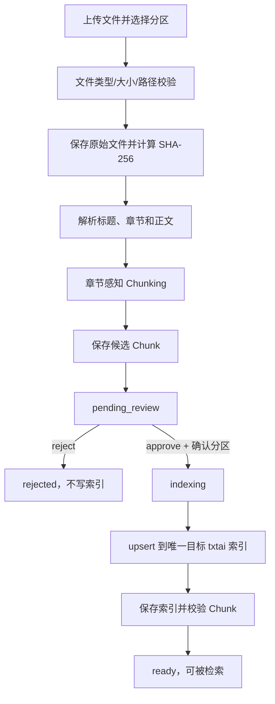
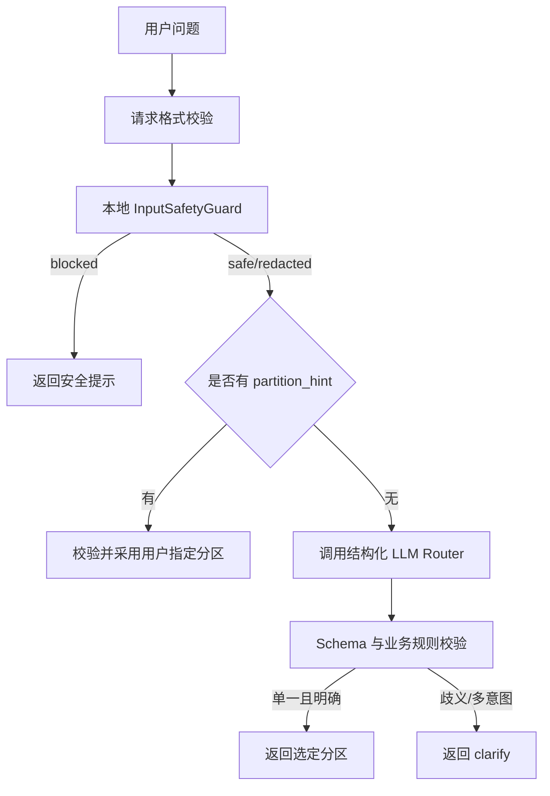
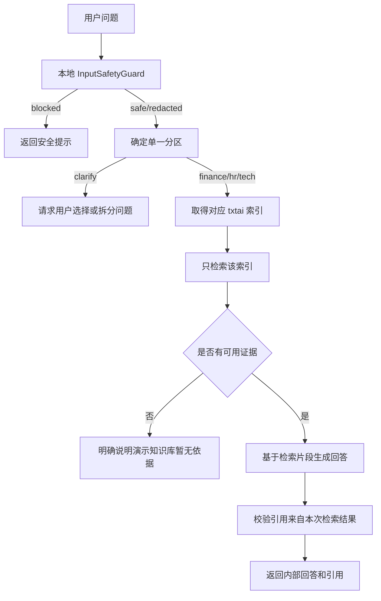

# 基于 txtai 的三分区知识库 MVP 实施规格

> 文档定位：第一轮可编码、可验证的实施规格。  
> 关联前端规格：`txtai-partitioned-kb-frontend-spec.md`。  
> 当前阶段：Round 1 / Partitioned Knowledge Base MVP。  
> 核心目标：验证文档选择分区上传、解析、Chunking、审核入库、稳定路由和单分区限定检索。  
> 技术基线：Python 3.11、FastAPI、txtai、Pydantic、SQLAlchemy、SQLite、pytest。  
> 文档版本：v1.3。  
> 更新时间：2026-09-01。

---

## 1. 本轮结论

第一轮只交付以下能力：

1. 建立 `finance`、`hr`、`tech` 三个独立 txtai 索引。
2. 上传文档时由用户明确选择 `finance`、`hr` 或 `tech` 分区。
3. 支持 PDF、DOCX、TXT 和 Markdown 的安全保存与文本解析。
4. 实现章节感知 Chunking，并生成稳定文档 ID 与 Chunk ID。
5. 解析结果先进入待审核区，审核确认分区后才能写入正式索引。
6. 为每个分区预置少量可重复构建的测试文档。
7. 在调用远程 LLM 前执行本地输入安全检查和必要脱敏。
8. 实现结构化分区路由，并提供 `/api/v1/route` 调试接口。
9. `/api/v1/chat` 支持显式 `partition_hint`。
10. 每次查询只允许访问一个最终选定的分区索引。
11. 建立 60 条路由测试集，输出准确率、分类报告和混淆矩阵。

本轮暂不实现：

- 登录、用户身份、角色和权限控制。
- 文档版本替换和复杂索引事务。
- 联网搜索与外部资料回写。
- 多分区并行召回。
- GraphRAG、多 Agent 或自主工具调用。
- 正式敏感数据接入。
- OCR、Excel、PPTX 和图片解析。
- 独立 Reranker 和模型微调。

本轮只能使用虚构或脱敏的演示数据。禁止将真实工资、个人信息、密码、Token、内部 IP、客户数据或未公开经营数据放入测试索引。

---

## 2. 核心设计原则

### 2.1 路由和检索职责分离

LLM 只负责理解问题并输出候选业务分区，不得直接选择索引对象、执行检索或决定是否联网。

最终索引选择必须由确定性业务代码完成：

```text
RouteDecision
→ RoutingPolicy
→ Partition 枚举
→ IndexRegistry.get(partition)
```

### 2.2 用户显式选择优先

当 `/chat` 或 `/route` 请求包含合法 `partition_hint` 时：

- 直接使用该分区。
- 不调用 LLM 路由器。
- 仍需执行输入安全检查和请求校验。
- 响应中的 `decision_source` 必须为 `user_hint`。

优先级固定为：

```text
合法 partition_hint
> 已确认的路由结果
> LLM 路由结果
> clarify
```

第一轮不实现服务端对话记忆，因此“已确认的路由结果”只作为后续扩展点，不在本轮编码。

### 2.3 不使用 LLM 自报数值置信度

禁止要求 LLM 输出 `confidence: 0.83` 并用固定阈值决定是否检索。这个数字不是校准概率，会随模型、Prompt 和示例变化。

第一轮改为：

- LLM 输出分类、备选分区和是否存在歧义。
- 业务层只接受合法、单一且无歧义的分类。
- 歧义或多意图问题返回 `clarify`。
- 系统可靠性通过 60 条标注数据测量，而不是相信单次模型自评分。

### 2.4 原始问题不得无条件发送给远程 LLM

在调用 Router LLM 和 Answer LLM 前，必须先经过本地 `InputSafetyGuard`。

安全处理结果分为：

```text
safe       可以使用原问题
redacted   只能使用脱敏后的问题
blocked    不得发送到远程 LLM
```

若配置为本地 LLM，仍执行格式、长度和明显密钥检测，但可以由配置决定是否需要脱敏。

### 2.5 单分区限定检索

一次请求最终只能选定一个业务分区，并且只能调用对应索引一次。

```text
finance 问题 → 只调用 finance 索引
hr 问题      → 只调用 hr 索引
tech 问题    → 只调用 tech 索引
clarify      → 不调用任何索引
```

跨分区问题第一轮返回澄清建议，不执行多个索引检索。

### 2.6 用户选区与审核确认

上传者必须选择一个目标分区。系统可以展示关键词提示，但第一轮不调用 LLM 自动替换用户选择。

文档解析和 Chunking 完成后进入 `pending_review`：

- 审核人可以查看标题、解析摘要和 Chunk 预览。
- 审核人必须确认最终分区，也可以在三个合法分区中修正。
- 只有 `approved` 动作可以触发正式索引写入。
- `rejected` 文档不得写入任何正式索引。
- 一份文档及其所有 Chunk 必须属于同一个最终分区。

本轮没有登录系统，`reviewed_by` 只是开发和演示阶段的审计文本，不代表真实身份认证或权限控制。

### 2.7 暂存区与正式索引隔离

原始文件、解析结果和候选 Chunk 属于暂存数据，txtai 的三个索引属于正式可检索数据。

```text
上传文件
→ raw 暂存
→ 解析与候选 Chunk
→ pending_review
→ 人工批准并确认分区
→ 写入唯一目标索引
→ ready
```

不得为了预览而提前把候选 Chunk 写入正式索引。

---

## 3. 总体数据流

### 3.1 文档审核入库数据流



### 3.2 `/route` 数据流



### 3.3 `/chat` 数据流



---

## 4. 业务分区

### 4.1 `finance`

包含：

- 差旅和日常报销。
- 发票、付款、预算和成本。
- 资产与会计处理。
- 财务审批流程。

典型问题：

- 北京出差住宿最多报销多少？
- 采购发票需要哪些附件？
- 服务器采购费用如何入账？

### 4.2 `hr`

包含：

- 招聘、入职、转正和离职。
- 考勤、请假、调休和加班。
- 劳动合同、绩效、福利和培训。

典型问题：

- 试用期转正需要提交哪些材料？
- 年假如何计算？
- 周末加班如何申请调休？

### 4.3 `tech`

包含：

- 软件架构、API 和数据库。
- Docker、网络、部署和运维。
- 开发规范、测试规范和故障处理。
- RAG、模型和算法技术文档。

典型问题：

- Docker 服务出现 502 如何排查？
- 单点登录回调地址如何配置？
- 如何重新构建 txtai 索引？

### 4.4 `clarify`

`clarify` 是路由控制状态，不是知识分区。以下情况进入 `clarify`：

- 一个问题包含两个必须分别检索的独立意图。
- 问题缺少关键对象，无法判断分区。
- LLM 输出多个并列候选，不能确定唯一分区。
- LLM 输出不符合 Schema，且一次修复重试后仍失败。

示例：

```text
新员工如何申请 GitLab 权限并报销认证考试费用？
```

返回建议：

```text
该问题包含技术权限申请和财务报销两个事项，请选择分区或拆成两个问题。
```

---

## 5. 推荐项目结构

```text
project-root/
├── app/
│   ├── main.py
│   ├── api/
│   │   ├── documents.py
│   │   ├── route.py
│   │   ├── chat.py
│   │   └── health.py
│   ├── core/
│   │   ├── config.py
│   │   ├── errors.py
│   │   └── logging.py
│   ├── models/
│   │   ├── partition.py
│   │   ├── document.py
│   │   ├── routing.py
│   │   ├── retrieval.py
│   │   └── chat.py
│   ├── services/
│   │   ├── file_storage.py
│   │   ├── parser.py
│   │   ├── chunker.py
│   │   ├── ingestion.py
│   │   ├── review.py
│   │   ├── input_safety.py
│   │   ├── router.py
│   │   ├── routing_policy.py
│   │   ├── index_registry.py
│   │   ├── retriever.py
│   │   └── answer_generator.py
│   ├── prompts/
│   │   ├── route_system.txt
│   │   └── answer_system.txt
│   └── db/
│       ├── base.py
│       ├── session.py
│       └── tables.py
├── data/
│   ├── raw/
│   │   └── {document_id}/
│   ├── staging/
│   ├── fixtures/
│   │   ├── finance.jsonl
│   │   ├── hr.jsonl
│   │   └── tech.jsonl
│   ├── indexes/
│   │   ├── finance/
│   │   ├── hr/
│   │   └── tech/
│   └── metadata/
│       └── knowledge.db
├── evaluation/
│   ├── routing_cases.jsonl
│   └── reports/
├── contracts/
│   └── openapi.json
├── scripts/
│   ├── seed_demo_indexes.py
│   ├── export_openapi.py
│   └── evaluate_routing.py
├── tests/
│   ├── unit/
│   ├── integration/
│   └── e2e/
├── .env.example
├── pyproject.toml
├── README.md
└── SPEC.md
```

`data/raw`、`data/staging`、`data/indexes`、SQLite 数据库和评估报告默认不提交 Git；测试数据、脚本和不包含敏感内容的评估样本可以提交。

---

## 6. 配置

建议依赖：

```text
python>=3.11,<3.13
fastapi
uvicorn[standard]
pydantic>=2
pydantic-settings
python-multipart
sqlalchemy>=2
aiosqlite
txtai[pipeline-data]
httpx
structlog
pytest
pytest-asyncio
```

实际版本必须锁定在 `pyproject.toml` 和锁文件中。Docling 相关依赖应先用一份 PDF 和一份 DOCX 完成解析冒烟测试。

```dotenv
APP_NAME=txtai-partitioned-knowledge-base-mvp
APP_ENV=development
APP_HOST=127.0.0.1
APP_PORT=8000

DATA_ROOT=./data
RAW_ROOT=./data/raw
STAGING_ROOT=./data/staging
INDEX_ROOT=./data/indexes
FIXTURE_ROOT=./data/fixtures
METADATA_DATABASE_URL=sqlite+aiosqlite:///./data/metadata/knowledge.db

EMBEDDING_MODEL=Qwen/Qwen3-Embedding-0.6B
RETRIEVAL_TOP_K=5

MAX_UPLOAD_SIZE_MB=25
ALLOWED_FILE_TYPES=pdf,docx,txt,md
CHUNK_TARGET_TOKENS=550
CHUNK_MIN_TOKENS=100
CHUNK_MAX_TOKENS=700
CHUNK_OVERLAP_TOKENS=75

LLM_PROVIDER=openai_compatible
LLM_BASE_URL=
LLM_API_KEY=
LLM_MODEL=
LLM_DATA_MODE=remote

MAX_QUESTION_LENGTH=2000
ROUTER_RETRY_COUNT=1
LOG_LEVEL=INFO
```

约束：

- `LLM_DATA_MODE` 只能是 `local` 或 `remote`。
- 密钥只能从环境变量读取。
- 不记录原始敏感问题、完整 Token 或脱敏前内容。
- 应用启动时检查三个索引目录是否存在并可加载。
- 应用启动时检查 raw、staging 和 metadata 目录，并执行数据库迁移。
- 上传大小和 Chunk 参数必须通过 Pydantic Settings 校验。
- 测试环境必须允许替换为 Fake LLM，以验证发送给模型的实际内容。

---

## 7. 数据模型

### 7.1 分区与路由枚举

```python
from enum import StrEnum
from pydantic import BaseModel, ConfigDict


class StrictApiRequest(BaseModel):
    model_config = ConfigDict(
        extra="forbid",
        str_strip_whitespace=True,
    )


class Partition(StrEnum):
    FINANCE = "finance"
    HR = "hr"
    TECH = "tech"


class RouteName(StrEnum):
    FINANCE = "finance"
    HR = "hr"
    TECH = "tech"
    CLARIFY = "clarify"


class DecisionSource(StrEnum):
    USER_HINT = "user_hint"
    LLM = "llm"
    SAFETY_FALLBACK = "safety_fallback"
```

### 7.2 文档与审核状态

```python
class DocumentStatus(StrEnum):
    UPLOADED = "uploaded"
    PARSING = "parsing"
    PENDING_REVIEW = "pending_review"
    INDEXING = "indexing"
    READY = "ready"
    REJECTED = "rejected"
    FAILED = "failed"


class ReviewAction(StrEnum):
    APPROVE = "approve"
    REJECT = "reject"
```

允许的状态迁移：

```text
uploaded → parsing → pending_review
parsing → failed
pending_review → rejected
pending_review → indexing → ready
indexing → failed
```

禁止跳过 `pending_review` 直接进入 `ready`。`ready`、`rejected` 和 `failed` 在第一轮视为终态；需要重试时创建明确的重试操作，不得由客户端任意修改状态字段。

### 7.3 文档记录

```python
class DocumentRecord(BaseModel):
    document_id: str
    original_filename: str
    stored_path: str
    mime_type: str
    size_bytes: int
    checksum_sha256: str
    selected_partition: Partition
    confirmed_partition: Partition | None = None
    title: str | None = None
    status: DocumentStatus
    chunk_count: int = 0
    created_at: datetime
    updated_at: datetime
    reviewed_at: datetime | None = None
    reviewed_by: str | None = None
    review_note: str | None = None
    error_code: str | None = None
    error_message: str | None = None
```

`selected_partition` 是上传时选择；`confirmed_partition` 是审核后的最终分区。正式索引写入只能使用 `confirmed_partition`。

### 7.4 候选 Chunk

```python
class ChunkCandidate(BaseModel):
    chunk_id: str
    document_id: str
    chunk_index: int
    text: str
    embedding_text: str
    title: str | None = None
    section_path: str | None = None
    page_start: int | None = None
    page_end: int | None = None
    checksum_sha256: str
```

候选 Chunk 在审核通过前存入 SQLite 或 staging 文件，不进入 txtai 正式索引。

### 7.5 审核请求

```python
class ReviewRequest(StrictApiRequest):
    action: ReviewAction
    confirmed_partition: Partition | None = None
    reviewer_name: str | None = Field(default=None, max_length=100)
    note: str | None = Field(default=None, max_length=500)
```

规则：

- `approve` 必须提供 `confirmed_partition`。
- `reject` 不允许触发索引写入。
- `reviewer_name` 仅用于 MVP 审计展示，不是可信身份。
- 只有 `pending_review` 文档可以审核。

### 7.6 输入安全结果

```python
class SafetyAction(StrEnum):
    SAFE = "safe"
    REDACTED = "redacted"
    BLOCKED = "blocked"


class SafetyDecision(BaseModel):
    action: SafetyAction
    safe_question: str | None
    detected_types: list[str]
    message: str | None = None
```

`detected_types` 只记录类型，例如 `token`、`private_ip`、`phone`，不得记录匹配到的原始值。

### 7.7 LLM 原始路由输出

```python
class LLMRouteOutput(BaseModel):
    route: RouteName
    alternative_route: Partition | None = None
    rewritten_query: str
    needs_clarification: bool
    reason_code: Literal[
        "finance_policy",
        "hr_policy",
        "technical_operation",
        "multi_intent",
        "missing_context",
        "ambiguous_domain",
    ]
```

禁止在该模型中增加数值 `confidence` 字段。

### 7.8 最终路由结果

```python
class RouteDecision(BaseModel):
    route: RouteName
    alternative_route: Partition | None = None
    rewritten_query: str
    needs_clarification: bool
    decision_source: DecisionSource
    safety_action: SafetyAction
    reason_code: str
```

### 7.9 检索结果

```python
class RetrievalHit(BaseModel):
    chunk_id: str
    document_id: str
    partition: Partition
    text: str
    score: float
    title: str
    section: str | None = None
```

### 7.10 API 请求与响应

```python
class RouteRequest(StrictApiRequest):
    question: str = Field(min_length=1, max_length=2000)
    partition_hint: Partition | None = None


class ChatRequest(StrictApiRequest):
    question: str = Field(min_length=1, max_length=2000)
    partition_hint: Partition | None = None


class Citation(BaseModel):
    chunk_id: str
    document_id: str
    title: str
    section: str | None = None
    page_start: int | None = None
    page_end: int | None = None


class ChatResponse(BaseModel):
    code: Literal[
        "OK",
        "ROUTE_CLARIFICATION_REQUIRED",
        "NO_INTERNAL_EVIDENCE",
        "SENSITIVE_INPUT_BLOCKED",
    ]
    answer: str
    route: RouteName
    decision_source: DecisionSource
    answerable: bool
    citations: list[Citation]
    suggested_partitions: list[Partition] = Field(default_factory=list)
    request_id: str
    warning: str | None = None
```

### 7.11 文档 API 响应模型

```python
class UploadDocumentResponse(BaseModel):
    document_id: str
    original_filename: str
    selected_partition: Partition
    confirmed_partition: Partition | None
    status: DocumentStatus
    chunk_count: int
    warnings: list[str]
    request_id: str


class DocumentSummaryResponse(BaseModel):
    document_id: str
    original_filename: str
    title: str | None
    selected_partition: Partition
    confirmed_partition: Partition | None
    status: DocumentStatus
    chunk_count: int
    created_at: datetime
    updated_at: datetime


class DocumentDetailResponse(DocumentSummaryResponse):
    mime_type: str
    size_bytes: int
    reviewed_at: datetime | None
    review_note: str | None
    error_code: str | None
    error_message: str | None
    request_id: str


class DocumentListResponse(BaseModel):
    items: list[DocumentSummaryResponse]
    total: int
    limit: int
    offset: int
    request_id: str


class ChunkPreviewItem(BaseModel):
    chunk_id: str
    chunk_index: int
    title: str | None
    section_path: str | None
    page_start: int | None
    page_end: int | None
    preview: str


class ChunkPreviewResponse(BaseModel):
    document_id: str
    title: str | None
    selected_partition: Partition
    confirmed_partition: Partition | None
    status: DocumentStatus
    chunk_count: int
    items: list[ChunkPreviewItem]
    total: int
    limit: int
    offset: int
    request_id: str


class ReviewResponse(BaseModel):
    document_id: str
    selected_partition: Partition
    confirmed_partition: Partition | None
    status: DocumentStatus
    indexed_chunk_count: int
    reviewed_at: datetime
    review_note: str | None
    request_id: str
```

公开 API 响应不得包含 `stored_path`、`checksum_sha256`、`embedding_text` 或服务器绝对路径。

### 7.12 路由、健康检查与错误响应

```python
class RouteResponse(RouteDecision):
    code: Literal[
        "OK",
        "ROUTE_CLARIFICATION_REQUIRED",
        "ROUTER_INVALID_OUTPUT",
        "SENSITIVE_INPUT_BLOCKED",
    ]
    request_id: str


class IndexHealth(BaseModel):
    finance: Literal["ready", "error"]
    hr: Literal["ready", "error"]
    tech: Literal["ready", "error"]


class HealthResponse(BaseModel):
    status: Literal["ok", "degraded"]
    metadata_database: Literal["ok", "error"]
    indexes: IndexHealth
    router: Literal["configured", "not_configured"]
    request_id: str


class ErrorResponse(BaseModel):
    code: str
    message: str
    request_id: str
    details: dict[str, object] | None = None
```

所有非 2xx 响应必须使用 `ErrorResponse`，包括 FastAPI/Pydantic 的 422 校验错误。服务端需要统一异常处理器，不能把框架默认的 `detail` 数组直接暴露给前端。

---

## 8. 输入安全预处理

### 8.1 执行位置

`InputSafetyGuard` 必须在所有 LLM Provider 调用之前执行。不得将安全检查仅放在联网搜索之前。

```python
safety = input_safety.inspect(request.question)

if safety.action == SafetyAction.BLOCKED:
    return build_safety_response(safety)

question_for_model = safety.safe_question
```

### 8.2 第一轮检测范围

使用本地确定性规则检测：

- 明显 API Key、Bearer Token、JWT 和私钥片段。
- 数据库连接串中的密码。
- IPv4 私网地址。
- 身份证号、手机号和邮箱。
- 超长问题、空问题和控制字符。
- 常见系统提示词窃取或覆盖指令，仅作为风险标签，不作为业务答案依据。

### 8.3 处理策略

| 类型 | remote 模式 | local 模式 |
| --- | --- | --- |
| 手机、邮箱、私网 IP | 使用占位符脱敏后继续 | 可配置为脱敏后继续 |
| Token、密码、私钥 | 阻止发送并提示用户删除敏感值 | 默认阻止 |
| 超长输入 | 拒绝并返回长度错误 | 拒绝并返回长度错误 |
| 普通业务问题 | 原样继续 | 原样继续 |

脱敏示例：

```text
原问题：10.10.11.21 上的财务服务 Docker 502 怎么处理？
安全问题：[PRIVATE_IP] 上的财务服务 Docker 502 怎么处理？
```

安全处理不得改变核心业务意图。如果脱敏后无法判断意图，返回 `blocked` 或要求用户提供 `partition_hint`，不能自行补全事实。

### 8.4 日志要求

允许记录：

- `request_id`。
- `safety_action`。
- `detected_types`。
- 输入长度。
- 是否使用远程模型。

禁止记录：

- 脱敏前问题。
- 被识别出的 Token、手机号、邮箱或 IP 原值。
- 完整 LLM 请求体。

---

## 9. 路由器设计

### 9.1 路由 Prompt

```text
你是企业知识库分区路由器，只负责选择知识分区，不回答问题。

可选结果：finance、hr、tech、clarify。

finance：报销、发票、预算、付款、成本、资产和会计处理。
hr：招聘、入职、合同、考勤、请假、绩效、薪酬、福利和培训。
tech：研发、API、数据库、部署、网络、运维、系统配置和故障处理。
clarify：问题包含多个独立意图，或缺少足够信息，无法选择唯一分区。

规则：
- 按用户最终想得到的答案分类，不按职业或单个名词分类。
- 一个明确问题只选择一个分区。
- 多个必须分别回答的事项选择 clarify。
- alternative_route 只在确实存在第二种合理解释时填写。
- rewritten_query 只能消除口语表达，不得增加事实。
- 不输出数值置信度。
- 只输出符合 JSON Schema 的 JSON。
```

### 9.2 路由参数

- `temperature=0`。
- 优先使用 Provider 原生结构化输出。
- JSON 或 Schema 校验失败最多修复重试一次。
- 第二次失败后返回 `clarify`，不得默认进入某一分区。
- Router 接收的只能是 `SafetyDecision.safe_question`。

### 9.3 确定性决策规则

```python
def decide_route(
    request: RouteRequest,
    safety: SafetyDecision,
    llm_output: LLMRouteOutput | None,
) -> RouteDecision:
    if request.partition_hint is not None:
        return from_user_hint(request.partition_hint, safety)

    if safety.action == SafetyAction.BLOCKED:
        return blocked_route(safety)

    if llm_output is None:
        return clarify_route("router_invalid_output", safety)

    if llm_output.needs_clarification:
        return clarify_route(llm_output.reason_code, safety)

    if llm_output.route == RouteName.CLARIFY:
        return clarify_route(llm_output.reason_code, safety)

    if llm_output.alternative_route is not None:
        return clarify_route("ambiguous_domain", safety)

    return accepted_llm_route(llm_output, safety)
```

这套规则没有运行时数值阈值。是否可以上线由离线评估结果决定。

### 9.4 后续校准扩展点

第一轮积累真实问题后，可以增加语义分类器或规则分类器，与 LLM 结果进行一致性校验：

```text
规则/语义分类与 LLM 一致 → 接受
两者不一致               → clarify 或人工选择
```

该扩展必须基于标注集验证，不能重新引入未经校准的 LLM 自报分数。

---

## 10. 三个独立 txtai 索引

### 10.1 目录

```text
data/indexes/finance/
data/indexes/hr/
data/indexes/tech/
```

### 10.2 Index Registry

```python
class IndexRegistry:
    def load_all(self) -> None: ...

    def get(self, partition: Partition) -> Embeddings: ...

    def upsert(
        self,
        partition: Partition,
        rows: list[dict],
    ) -> None: ...

    def delete(
        self,
        partition: Partition,
        chunk_ids: list[str],
    ) -> None: ...

    def save(self, partition: Partition) -> None: ...

    def close_all(self) -> None: ...
```

要求：

- 三个分区创建三个不同的 `Embeddings` 实例。
- 三个实例使用相同 Embedding 模型和检索配置。
- `get()` 只接受 `Partition` 枚举，禁止接受任意路径字符串。
- 预置数据和审核通过的文档都使用稳定 Chunk ID 和 `upsert()`。
- 重复执行 seed 脚本不能生成重复 Chunk。
- 本轮默认单进程、单 Worker。
- 每个分区至少有一个写锁，`upsert/delete/save` 位于同一个写临界区。

### 10.3 数据格式

```json
{
  "id": "finance-travel:v1:0001",
  "text": "文档：演示差旅制度\n章节：住宿标准\n正文：一线城市住宿演示上限为每人每天 600 元。",
  "document_id": "finance-travel",
  "partition": "finance",
  "title": "演示差旅制度",
  "section": "住宿标准"
}
```

即使索引已经物理分开，也必须保留 `partition` 元数据。检索结果返回后必须执行业务校验：

```python
if any(hit.partition != requested_partition for hit in hits):
    raise PartitionIsolationError(requested_partition)
```

不得使用生产环境中可能被优化掉的裸 `assert`。

---

## 11. 文档上传、解析、Chunking 与审核入库

### 11.1 上传接口边界

上传请求必须包含：

- 一个文件。
- 用户选择的一个合法分区。
- 可选自定义标题。

分区选择规则：

- 默认不预选，用户必须主动选择。
- 只能单选 `finance`、`hr` 或 `tech`。
- 每个选项显示分区名称和一句范围说明，避免只显示英文代码。
- 前端如后续实现，使用单选按钮或分段选择控件，不使用自由文本输入。
- 后端始终再次校验枚举，不能信任前端传值。
- 上传结果页同时展示“上传选择分区”和“审核确认分区”。

第一轮采用同步解析：上传接口完成文件保存、正文解析和 Chunking 后返回 `pending_review`。若文件较大导致响应时间不可接受，下一轮再引入后台任务队列；不得在第一轮同时维护同步和异步两套流程。

### 11.2 文件校验与安全保存

支持格式：

| 扩展名 | MIME 类型示例 | 解析方式 |
| --- | --- | --- |
| `.pdf` | `application/pdf` | Textractor / Docling |
| `.docx` | `application/vnd.openxmlformats-officedocument.wordprocessingml.document` | Textractor / Docling |
| `.txt` | `text/plain` | UTF-8 文本读取，带编码错误处理 |
| `.md` | `text/markdown`、`text/plain` | Markdown 标题解析 |

校验规则：

- 扩展名和检测到的 MIME 类型必须匹配允许列表。
- 文件大小不得超过 `MAX_UPLOAD_SIZE_MB`。
- 空文件、损坏文件、加密但无法读取的文件直接失败。
- 原始文件名只作为展示字段，不参与目录定位。
- 系统生成 `document_id`，并清理路径分隔符、`..`、控制字符和危险扩展名。
- 保存时计算 SHA-256，不能只依赖文件名判断重复。
- 同一 SHA-256 已存在于非 `rejected/failed` 记录时返回重复提示，不重复解析。

保存路径：

```text
data/raw/{document_id}/{safe_filename}
data/staging/{document_id}/parse.json
```

原始文件路径不包含分区，因为审核阶段可能修正分区；最终分区只决定写入哪个 txtai 索引。

### 11.3 元数据表

第一轮使用 SQLite 保存文档状态和候选 Chunk。

`documents` 表至少包含：

```text
id                       VARCHAR PRIMARY KEY
original_filename        VARCHAR NOT NULL
stored_path              VARCHAR NOT NULL
mime_type                VARCHAR NOT NULL
size_bytes               INTEGER NOT NULL
checksum_sha256           VARCHAR NOT NULL
selected_partition       VARCHAR NOT NULL
confirmed_partition      VARCHAR NULL
title                    VARCHAR NULL
status                   VARCHAR NOT NULL
chunk_count              INTEGER NOT NULL DEFAULT 0
reviewed_by              VARCHAR NULL
review_note              TEXT NULL
reviewed_at              DATETIME NULL
error_code               VARCHAR NULL
error_message            TEXT NULL
created_at               DATETIME NOT NULL
updated_at               DATETIME NOT NULL
```

`chunk_candidates` 表至少包含：

```text
id                       VARCHAR PRIMARY KEY
document_id              VARCHAR NOT NULL
chunk_index              INTEGER NOT NULL
text                     TEXT NOT NULL
embedding_text           TEXT NOT NULL
title                    VARCHAR NULL
section_path             VARCHAR NULL
page_start               INTEGER NULL
page_end                 INTEGER NULL
checksum_sha256           VARCHAR NOT NULL
indexed_at               DATETIME NULL
```

约束：

- `documents.checksum_sha256` 建立索引。
- `chunk_candidates(document_id, chunk_index)` 唯一。
- 删除文档主记录时不得留下孤立候选 Chunk。
- API 不允许客户端直接提交或修改 `status`。

### 11.4 文档解析接口

```python
class ExtractedSection(BaseModel):
    order: int
    text: str
    title: str | None = None
    section_path: str | None = None
    page_start: int | None = None
    page_end: int | None = None


class DocumentParser(Protocol):
    def parse(self, path: Path, mime_type: str) -> list[ExtractedSection]: ...
```

实现要求：

- PDF 和 DOCX 优先使用 `Textractor(backend="docling", sections=True)`，但必须通过一个本地样本文档验证真实返回结构后再完成适配器。
- TXT 和 Markdown 使用轻量本地解析，不必强制经过 Docling。
- 解析输出统一转换为 `ExtractedSection`，上层不得依赖不同解析器的原始对象。
- 去除重复页眉、页脚、连续空白和纯装饰字符。
- 保留标题、条款编号、日期、金额、错误码和代码块。
- 无法提取有效正文时状态进入 `failed`，不得生成空 Chunk。
- 解析和 Embedding 属于阻塞工作；FastAPI 异步路由应放入线程池，避免阻塞事件循环。

### 11.5 Chunking 规则

第一轮采用“章节优先、Token 长度兜底”：

1. 先按解析器提供的标题和章节边界切分。
2. 一个章节超过 `CHUNK_MAX_TOKENS` 时，再按段落切分。
3. 段落仍过长时，按 Token 窗口切分。
4. 目标长度为 `CHUNK_TARGET_TOKENS`，允许范围为 100～700 tokens。
5. 相邻长文本 Chunk 重叠约 75 tokens。
6. 单条制度条款、表格表头与数据行、完整代码块尽量保持在同一 Chunk。
7. 小于最小长度的尾块优先合并到前一块，不能无条件丢弃。
8. 每个 Chunk 保留标题、章节路径和页码范围。

参与 Embedding 的文本格式：

```text
文档：演示差旅制度
章节：第三章 > 住宿标准
正文：一线城市住宿演示上限为每人每天 600 元……
```

展示给用户的 `text` 保留正文，不必重复标题前缀；用于向量化的 `embedding_text` 保存完整上下文。

### 11.6 稳定 ID

第一轮不实现文档版本替换，所有文档固定为 `v1`：

```text
document_id：系统生成的不可猜测 ID，例如 doc_01jabc...
chunk_id：{document_id}:v1:{chunk_index:05d}
```

同一次上传重试必须复用既有 `document_id` 和 Chunk ID。Chunk 顺序必须由标准化解析结果确定，不能使用随机数生成 Chunk ID。

### 11.7 审核预览

审核页面或 API 至少展示：

- 原始文件名和自定义标题。
- 上传者选择的分区。
- 当前文档状态。
- 解析出的章节数量和 Chunk 数量。
- 每个 Chunk 的前 300 个字符、章节路径和页码。
- 重复文件提示和解析警告。

不得在审核响应中返回服务器绝对路径。预览默认分页，不能一次返回整份大文档。

### 11.8 审核决策

批准：

```text
pending_review
→ 校验 confirmed_partition
→ 状态改为 indexing
→ 将全部候选 Chunk 补充 confirmed_partition 元数据
→ upsert 到唯一目标索引
→ save 目标索引
→ 回读或搜索抽样验证
→ 标记 Chunk indexed_at
→ 文档状态改为 ready
```

拒绝：

```text
pending_review
→ 保存审核备注
→ 状态改为 rejected
→ 不调用任何 txtai 索引
```

审核修改分区时，只更新 `confirmed_partition`；`selected_partition` 保留原值用于审计。

### 11.9 写入一致性与补偿

txtai 索引和 SQLite 不是同一个事务，第一轮采用明确补偿：

- 审核批准前保存本次预期写入的全部 Chunk ID。
- `upsert()` 和 `save()` 必须在目标分区写锁内完成。
- 写入或保存失败时，使用预期 Chunk ID 从同一索引补偿删除并再次保存。
- 补偿成功或失败都记录到文档错误信息。
- 只有索引保存和抽样验证成功后才能将文档标记为 `ready`。
- Retriever 只能返回元数据数据库中状态为 `ready` 的文档 Chunk。
- 应用启动时扫描遗留 `indexing` 状态并标记为需要恢复，不能自动宣称成功。

第一轮不支持修改 `ready` 文档的分区。需要修改时先删除演示数据并重新上传；正式版本迁移在下一轮设计。

---

## 12. 预置测试文档

每个分区预置两份虚构文档，每份包含 3～5 个 Chunk。

### 12.1 Finance fixtures

```text
finance-travel：演示差旅制度
- 住宿演示标准
- 交通费用演示规则
- 报销附件清单

finance-invoice：演示发票处理规范
- 发票抬头
- 发票查验
- 退票处理
```

### 12.2 HR fixtures

```text
hr-probation：演示转正规范
- 申请时间
- 申请材料
- 审批步骤

hr-leave：演示请假制度
- 年假计算
- 事假申请
- 调休规则
```

### 12.3 Tech fixtures

```text
tech-deployment：演示部署手册
- Docker 启动
- Nginx 502 排查
- 健康检查

tech-sso：演示单点登录手册
- OAuth 回调配置
- Token 生命周期
- 常见登录错误
```

Fixture 要求：

- 内容必须明确标记为演示数据。
- 金额、日期、域名和账号必须是虚构值。
- 每个 Chunk 使用稳定 ID。
- 文档答案应足够明确，便于检索断言。
- 每个分区至少准备两个“相似但答案不同”的 Chunk，用于测试误召回。
- seed 脚本必须同时写入对应的 SQLite 文档记录，并设置 `status=ready` 和正确的 `confirmed_partition`。
- seed 只允许在 development/test 环境运行，不属于普通用户上传流程。

---

## 13. API 设计

### 13.1 通用合约

以下规则适用于 `/api/v1` 的全部接口：

- 请求和响应使用 UTF-8。
- JSON 字段使用 `snake_case`。
- 时间使用 ISO 8601 UTC，例如 `2026-09-01T08:30:00Z`。
- 可空字段在响应中显式返回 `null`，不因当前为空而随意省略。
- 每个响应体都包含 `request_id`，响应头同时返回 `X-Request-ID`。
- 所有非 2xx 响应统一为 `ErrorResponse`。
- 业务性结果可以使用 HTTP 200，但必须通过稳定 `code` 区分。
- 分页统一使用 `limit` 和 `offset`，`limit` 默认 20、最小 1、最大 100，`offset` 默认 0。
- 枚举值严格区分大小写，只接受文档定义的小写字符串。
- 所有公开请求模型继承 `StrictApiRequest`，通过 `extra="forbid"` 拒绝未定义字段，避免前后端悄悄传错字段。

字段限制：

| 字段 | 限制 |
| --- | --- |
| `question` | trim 后 1～2000 个字符 |
| `title` | 可选，trim 后最多 200 个字符 |
| `reviewer_name` | 可选，最多 100 个字符 |
| `note` | 可选，最多 500 个字符 |
| `document_id` | 系统生成，只允许规定 ID 格式，不接受路径字符 |
| `limit` | 1～100，默认 20 |
| `offset` | 大于等于 0，默认 0 |

契约来源：

1. 本文档定义设计期契约。
2. 实现后以 FastAPI `/openapi.json` 为运行期唯一事实来源。
3. `scripts/export_openapi.py` 将 `app.openapi()` 稳定导出到 `contracts/openapi.json`。
4. 前端 TypeScript 类型必须从该 OpenAPI 快照生成。
5. 后端修改字段、枚举或状态码时，必须在同一变更中更新快照、前端类型和契约测试。

通用错误示例：

```json
{
  "code": "INVALID_PARTITION",
  "message": "partition 必须是 finance、hr 或 tech",
  "request_id": "req_01jxyz",
  "details": {
    "field": "partition"
  }
}
```

### 13.2 上传并选择分区

```http
POST /api/v1/documents
Content-Type: multipart/form-data
```

成功状态：`201 Created`。响应模型：`UploadDocumentResponse`。

字段：

| 字段 | 必填 | 说明 |
| --- | --- | --- |
| `file` | 是 | PDF、DOCX、TXT 或 Markdown |
| `partition` | 是 | `finance`、`hr` 或 `tech` |
| `title` | 否 | 自定义文档标题 |

成功响应：

```json
{
  "document_id": "doc_01jabc",
  "original_filename": "演示差旅制度.pdf",
  "selected_partition": "finance",
  "confirmed_partition": null,
  "status": "pending_review",
  "chunk_count": 8,
  "warnings": [],
  "request_id": "req_01jxyz"
}
```

上传成功只代表解析和 Chunking 完成，不代表已经进入知识库。只有 `status=ready` 的文档可以被检索。

主要失败：`409 DUPLICATE_DOCUMENT`、`413 FILE_TOO_LARGE`、`415 UNSUPPORTED_FILE_TYPE`、`422 EMPTY_DOCUMENT`、`422 DOCUMENT_PARSE_FAILED`。重复文件错误的 `details` 必须包含已有 `document_id` 和 `status`。

### 13.3 查询文档和待审核列表

```http
GET /api/v1/documents/{document_id}
GET /api/v1/documents?status=pending_review&limit=20&offset=0
```

详情成功状态：`200 OK`，响应模型：`DocumentDetailResponse`。

详情响应：

```json
{
  "document_id": "doc_01jabc",
  "original_filename": "演示差旅制度.pdf",
  "title": "演示差旅制度",
  "selected_partition": "finance",
  "confirmed_partition": null,
  "status": "pending_review",
  "chunk_count": 8,
  "created_at": "2026-09-01T08:30:00Z",
  "updated_at": "2026-09-01T08:30:02Z",
  "mime_type": "application/pdf",
  "size_bytes": 182400,
  "reviewed_at": null,
  "review_note": null,
  "error_code": null,
  "error_message": null,
  "request_id": "req_01jxyz"
}
```

列表成功状态：`200 OK`，响应模型：`DocumentListResponse`。`status` 是可选 `DocumentStatus` 查询参数。

```json
{
  "items": [
    {
      "document_id": "doc_01jabc",
      "original_filename": "演示差旅制度.pdf",
      "title": "演示差旅制度",
      "selected_partition": "finance",
      "confirmed_partition": null,
      "status": "pending_review",
      "chunk_count": 8,
      "created_at": "2026-09-01T08:30:00Z",
      "updated_at": "2026-09-01T08:30:02Z"
    }
  ],
  "total": 1,
  "limit": 20,
  "offset": 0,
  "request_id": "req_01jxyz"
}
```

列表只返回元数据和统计信息，不返回完整正文。不存在的详情返回 `404 DOCUMENT_NOT_FOUND`。

### 13.4 获取审核预览

```http
GET /api/v1/documents/{document_id}/preview?limit=20&offset=0
```

成功状态：`200 OK`。响应模型：`ChunkPreviewResponse`。只有已经产生候选 Chunk 的文档可以预览；尚未生成 Chunk 时返回 `409 PREVIEW_NOT_READY`。

响应：

```json
{
  "document_id": "doc_01jabc",
  "title": "演示差旅制度",
  "selected_partition": "finance",
  "confirmed_partition": null,
  "status": "pending_review",
  "chunk_count": 8,
  "items": [
    {
      "chunk_id": "doc_01jabc:v1:00000",
      "chunk_index": 0,
      "title": "演示差旅制度",
      "section_path": "第三章 > 住宿标准",
      "page_start": 4,
      "page_end": 4,
      "preview": "一线城市住宿演示上限为……"
    }
  ],
  "total": 8,
  "limit": 20,
  "offset": 0,
  "request_id": "req_01jxyz"
}
```

### 13.5 审核并确认分区

```http
POST /api/v1/documents/{document_id}/review
Content-Type: application/json
```

成功状态：`200 OK`。响应模型：`ReviewResponse`。

批准请求：

```json
{
  "action": "approve",
  "confirmed_partition": "finance",
  "reviewer_name": "demo-reviewer",
  "note": "章节和分区确认无误"
}
```

拒绝请求：

```json
{
  "action": "reject",
  "confirmed_partition": null,
  "reviewer_name": "demo-reviewer",
  "note": "文件内容不完整"
}
```

批准成功响应：

```json
{
  "document_id": "doc_01jabc",
  "selected_partition": "finance",
  "confirmed_partition": "finance",
  "status": "ready",
  "indexed_chunk_count": 8,
  "reviewed_at": "2026-09-01T08:35:00Z",
  "review_note": "章节和分区确认无误",
  "request_id": "req_01jxyz"
}
```

拒绝成功使用相同响应模型，其中 `status="rejected"`、`confirmed_partition=null`、`indexed_chunk_count=0`。主要失败：`404 DOCUMENT_NOT_FOUND`、`409 INVALID_DOCUMENT_STATE`、`422 REVIEW_PARTITION_REQUIRED`、`500 INDEX_WRITE_FAILED`。

审核接口第一轮没有真实权限保护，只能用于本地演示环境。部署到共享环境前必须先接入登录和审核权限。

### 13.6 路由调试接口

```http
POST /api/v1/route
Content-Type: application/json
```

成功状态：`200 OK`。响应模型：`RouteResponse`。

请求：

```json
{
  "question": "技术人员出差如何报销？",
  "partition_hint": null
}
```

响应：

```json
{
  "code": "OK",
  "route": "finance",
  "alternative_route": null,
  "rewritten_query": "员工出差费用如何报销",
  "needs_clarification": false,
  "decision_source": "llm",
  "safety_action": "safe",
  "reason_code": "finance_policy",
  "request_id": "req_01jxyz"
}
```

接口不得返回：

- LLM 隐藏思考过程。
- 脱敏前后的敏感值对照。
- Prompt 全文。
- API Key 或 Provider 请求体。

### 13.7 单分区问答接口

```http
POST /api/v1/chat
Content-Type: application/json
```

成功或业务性不可回答状态均使用 `200 OK`。响应模型：`ChatResponse`。

请求：

```json
{
  "question": "住宿演示标准是多少？",
  "partition_hint": "finance"
}
```

响应：

```json
{
  "code": "OK",
  "answer": "根据《演示差旅制度》，一线城市住宿演示上限为每人每天 600 元。",
  "route": "finance",
  "decision_source": "user_hint",
  "answerable": true,
  "citations": [
    {
      "chunk_id": "finance-travel:v1:0001",
      "document_id": "finance-travel",
      "title": "演示差旅制度",
      "section": "住宿标准",
      "page_start": 4,
      "page_end": 4
    }
  ],
  "suggested_partitions": [],
  "request_id": "req_example",
  "warning": null
}
```

`partition_hint` 非法时返回 `422 INVALID_PARTITION`，不能交给 LLM 猜测。

### 13.8 Clarify 响应

```json
{
  "code": "ROUTE_CLARIFICATION_REQUIRED",
  "answer": "该问题包含多个事项，请选择 finance、hr 或 tech，或者拆分后提问。",
  "route": "clarify",
  "decision_source": "llm",
  "answerable": false,
  "citations": [],
  "suggested_partitions": ["finance", "tech"],
  "request_id": "req_example",
  "warning": "需要确认知识分区。"
}
```

`clarify` 响应不得调用任何 txtai 索引。

无证据时返回 `code="NO_INTERNAL_EVIDENCE"`；输入安全阻断时返回 `code="SENSITIVE_INPUT_BLOCKED"`。两者均为 HTTP 200、`answerable=false`，且 `citations=[]`。

### 13.9 健康检查

```http
GET /api/v1/health
```

正常状态：`200 OK`，响应模型为 `HealthResponse`。任一必需组件不可用时返回 `503 Service Unavailable` 和通用 `ErrorResponse`，其中 `code="SERVICE_UNAVAILABLE"`，组件状态放在 `details.health`。

响应至少包含：

```json
{
  "status": "ok",
  "metadata_database": "ok",
  "indexes": {
    "finance": "ready",
    "hr": "ready",
    "tech": "ready"
  },
  "router": "configured",
  "request_id": "req_01jxyz"
}
```

---

## 14. 单分区检索与回答

### 14.1 检索接口

```python
class Retriever:
    def search(
        self,
        partition: Partition,
        query: str,
        limit: int = 5,
    ) -> list[RetrievalHit]: ...
```

### 14.2 查询选择

第一轮优先使用原问题检索。`rewritten_query` 只在以下情况替代原问题：

- 原问题是明显口语化表达。
- 改写没有删除错误码、产品名、金额和专业术语。
- 改写来自合法 Router 输出。

服务应在日志中记录使用了 `original` 还是 `rewritten`，但不得记录敏感正文。

### 14.3 最小证据规则

本轮不实现独立 Evidence Gate，但必须满足以下最低要求：

- 没有命中结果时直接返回 `answerable=false`。
- 命中结果必须通过 SQLite 文档状态校验，只保留 `status=ready` 且 `confirmed_partition` 与目标分区一致的文档。
- Answer LLM 只能接收本次选定分区的 Top-K 片段。
- 回答必须输出引用 Chunk ID。
- 服务端验证引用全部来自本次命中。
- 引用为空或包含未知 ID 时，结果降级为不可回答。
- 不允许使用模型记忆补充演示制度、金额、日期或步骤。

### 14.4 核心编排

```python
async def answer_question(request: ChatRequest) -> ChatResponse:
    request_id = new_request_id()
    safety = input_safety.inspect(request.question)

    if safety.action == SafetyAction.BLOCKED:
        return build_safety_response(safety, request_id)

    route = await routing_service.route(
        safe_question=safety.safe_question,
        partition_hint=request.partition_hint,
        safety=safety,
    )

    if route.route == RouteName.CLARIFY:
        return build_clarify_response(route, request_id)

    partition = Partition(route.route.value)
    hits = retriever.search(
        partition=partition,
        query=select_retrieval_query(request.question, route, safety),
        limit=settings.retrieval_top_k,
    )

    validate_hits_belong_to_partition(hits, partition)

    if not hits:
        return build_no_evidence_response(route, request_id)

    answer = await answer_generator.generate(
        question=safety.safe_question,
        hits=hits,
    )

    return validate_and_build_internal_response(
        route=route,
        answer=answer,
        hits=hits,
        request_id=request_id,
    )
```

---

## 15. 60 条路由测试集

### 15.1 数据分布

`evaluation/routing_cases.jsonl` 固定为 60 条：

| 期望结果 | 数量 |
| --- | ---: |
| finance | 15 |
| hr | 15 |
| tech | 15 |
| clarify | 15 |
| 合计 | 60 |

除 `expected_route` 外，每条样本还必须设置独立的 `case_type`。建议分布为：

| case_type | 数量 | 说明 |
| --- | ---: | --- |
| direct | 30 | 意图清晰，但不能全部依赖明显关键词 |
| indirect | 10 | 口语、同义词或间接表达 |
| boundary | 5 | 跨领域名词存在，但最终意图仍属于单一分区 |
| multi_intent | 10 | 包含两个必须分别回答的事项 |
| missing_context | 5 | 缺少关键对象，应进入 clarify |
| 合计 | 60 | 与路由标签是两个正交维度 |

数据格式：

```json
{"id":"route-001","question":"差旅住宿费最多报多少？","expected_route":"finance","case_type":"direct"}
{"id":"route-016","question":"试用期转正需要哪些材料？","expected_route":"hr","case_type":"direct"}
{"id":"route-031","question":"Docker 容器启动后访问 502","expected_route":"tech","case_type":"direct"}
{"id":"route-046","question":"申请 GitLab 权限并报销培训费","expected_route":"clarify","case_type":"multi_intent"}
```

测试集必须覆盖：

- 不依赖明显关键词的问题。
- 带其他部门身份词但核心意图明确的问题。
- 中英文混合技术术语。
- 多意图和缺少对象的问题。
- 容易混淆的“财务系统技术故障”和“系统中的财务业务规则”。
- 同义表达、口语表达和简短追问式表达。

### 15.2 评估脚本输出

`scripts/evaluate_routing.py` 必须生成：

```text
evaluation/reports/routing-summary.json
evaluation/reports/confusion-matrix.csv
evaluation/reports/misclassified-cases.jsonl
```

控制台输出至少包含：

- 总体准确率。
- finance、hr、tech、clarify 的 precision、recall、F1。
- 4×4 混淆矩阵。
- 错分样本 ID、期望结果和实际结果。
- JSON/Schema 合法率。
- 平均路由耗时。

混淆矩阵格式：

```csv
expected/predicted,finance,hr,tech,clarify
finance,0,0,0,0
hr,0,0,0,0
tech,0,0,0,0
clarify,0,0,0,0
```

### 15.3 验收目标

- 总体准确率不低于 90%。
- finance、hr、tech 各自召回率不低于 85%。
- 明确单分区问题被错误送入另一业务分区的比例低于 5%。
- 结构化输出合法率达到 99%，测试环境目标为 100%。
- `partition_hint` 路由正确率为 100%。
- 多意图问题不得强制进入单一分区。

60 条数据只能用于第一轮基线评估，不足以证明生产准确率。修改 Prompt 或模型后必须重新执行全量评估，并保留报告。

---

## 16. 测试要求

### 16.1 上传、解析、Chunking 与审核测试

至少覆盖：

- 合法 PDF、DOCX、TXT 和 Markdown 可以解析为候选 Chunk。
- 非法扩展名、MIME 不匹配、空文件和超大文件被拒绝。
- 上传文件名包含 `..` 或路径分隔符时不会逃逸受控目录。
- 相同哈希重复上传不会重复解析或建立重复文档。
- 标题、章节路径、页码、金额、错误码和代码块按规则保留。
- 长章节按 Token 拆分，尾部短块正确合并。
- Chunk ID 在同一解析结果下保持稳定。
- `pending_review` 文档不能被 Retriever 返回。
- `reject` 不调用任何 txtai 索引。
- 审核将 finance 修正为 tech 时只写入 tech 索引。
- `upsert/save` 失败时执行补偿，文档不会进入 `ready`。
- 只有索引保存和验证成功后文档才进入 `ready`。

### 16.2 输入安全测试

至少覆盖：

- 普通问题原样通过。
- 私网 IP 被替换为占位符。
- 手机和邮箱被脱敏。
- Token、JWT、数据库密码被阻止。
- 超长和空问题被拒绝。
- Fake Remote LLM 实际收到的内容不包含原始敏感值。
- 日志不包含脱敏前内容。

### 16.3 路由单元测试

至少覆盖：

- 合法结构化输出。
- 非法枚举。
- 缺失字段。
- 多余解释文本。
- 一次修复重试。
- 重试失败进入 `clarify`。
- `alternative_route` 非空进入 `clarify`。
- `partition_hint` 跳过 LLM 调用。

### 16.4 索引隔离测试

必须验证：

1. finance 请求只调用 finance 索引。
2. hr 请求只调用 hr 索引。
3. tech 请求只调用 tech 索引。
4. clarify 请求不调用索引。
5. 返回结果的 `partition` 与请求分区不一致时拒绝回答。
6. 重复运行 seed 脚本不会增加重复 Chunk。
7. 应用重启后可以重新加载三个索引。
8. 只有元数据状态为 `ready` 的文档结果可以返回。

建议为三个 Index 实例使用不同 Spy，断言未选中索引的调用次数为 0。

### 16.5 API 集成测试

覆盖：

- `/documents` 上传并选择分区后返回 `pending_review`。
- `/documents/{id}` 返回状态但不暴露绝对路径。
- `/documents/{id}/preview` 分页返回候选 Chunk 摘要。
- `/documents/{id}/review` 批准后写入确认分区并返回 `ready`。
- `/documents/{id}/review` 拒绝后不写索引。
- 只有 `pending_review` 文档可以审核。
- `/route` 正常路由。
- `/route` 使用 `partition_hint`。
- `/route` 返回 clarify。
- `/chat` 完成单分区检索并返回引用。
- `/chat` 无命中时明确返回无依据。
- 非法 `partition_hint` 返回 422。
- 输入安全阻断时没有发生 LLM 和索引调用。
- `/health` 返回三个索引状态。

### 16.6 API 契约测试

必须覆盖：

- `/openapi.json` 包含全部七个业务接口和健康检查。
- OpenAPI 中请求、响应、枚举和 nullable 定义与第 7、13 节一致。
- 上传成功为 201，其余文档读取与审核成功状态符合接口定义。
- 所有成功响应体包含 `request_id`，并与 `X-Request-ID` 响应头一致。
- 所有非 2xx 响应符合 `ErrorResponse`，包括 Pydantic 422。
- 分区字段校验失败使用 `INVALID_PARTITION`，其他字段校验使用 `VALIDATION_ERROR`。
- 文档列表和预览分页回显 `total/limit/offset`。
- API 响应不包含 `stored_path`、`checksum_sha256` 或 `embedding_text`。
- Chat 的四个业务 code 和 Route 的业务 code 均有固定响应样本。
- 保存一份经过审查的 OpenAPI 快照，契约变更时必须显式更新。

---

## 17. 分阶段实施

### Phase 0：项目骨架

- [ ] 创建 FastAPI 项目。
- [ ] 配置 Pydantic Settings。
- [ ] 定义错误码、请求 ID 和结构化日志。
- [ ] 实现统一 `ErrorResponse` 异常处理器。
- [ ] 实现 `export_openapi.py` 并生成初始契约快照。
- [ ] 添加 `/health`。
- [ ] 建立 SQLite 数据库、迁移入口和文档状态表。
- [ ] 锁定依赖版本。

交付：应用和测试框架可以启动。

### Phase 1：三个独立索引与演示数据

- [ ] 实现 `Partition` 枚举。
- [ ] 实现 `IndexRegistry`。
- [ ] 建立 finance/hr/tech 三个索引目录。
- [ ] 编写六份演示文档 fixture。
- [ ] 实现幂等 seed 脚本。
- [ ] 完成加载、持久化和隔离测试。

交付：三个索引可以独立查询演示数据。

### Phase 2：上传、解析、Chunking 与审核入库

- [ ] 实现安全文件保存、MIME 和大小校验。
- [ ] 实现 PDF、DOCX、TXT、Markdown 解析适配器。
- [ ] 实现章节感知 Chunker 和稳定 Chunk ID。
- [ ] 保存文档与候选 Chunk 元数据。
- [ ] 实现上传、状态查询和分页预览接口。
- [ ] 实现 approve/reject 审核接口。
- [ ] 批准时只写 `confirmed_partition` 对应索引。
- [ ] 实现写入失败补偿和状态恢复标记。
- [ ] 完成待审核隔离和审核改区测试。

交付：上传文档选择分区后可以解析、预览、审核并进入唯一正式索引。

### Phase 3：输入安全与路由

- [ ] 实现 `InputSafetyGuard`。
- [ ] 实现 LLM Provider 抽象和 Fake Provider。
- [ ] 定义无数值置信度的路由 Schema。
- [ ] 实现 Router 和 `RoutingPolicy`。
- [ ] 实现 `/api/v1/route`。
- [ ] 验证远程模型只收到安全处理后的问题。

交付：输入可以安全地路由到单一分区或 clarify。

### Phase 4：限定检索与 `/chat`

- [ ] 实现 `partition_hint`。
- [ ] 实现 Retriever。
- [ ] 强制单索引调用。
- [ ] 实现最小内部回答和引用校验。
- [ ] 实现 `/api/v1/chat`。
- [ ] 完成端到端测试。

交付：问题可以在唯一选定分区中检索并返回带引用回答。

### Phase 5：路由评估

- [ ] 建立 60 条路由测试集。
- [ ] 实现评估脚本。
- [ ] 输出分类报告和混淆矩阵。
- [ ] 分析错分样本。
- [ ] 调整 Prompt 或模型并重新评估。
- [ ] 在 README 中记录基线结果。

交付：路由质量可测量、可复现，而不是依赖主观 confidence。

---

## 18. 错误码

| 错误码 | HTTP | 说明 |
| --- | ---: | --- |
| `VALIDATION_ERROR` | 422 | 请求字段缺失、类型错误或超出约束 |
| `INVALID_PARTITION` | 422 | 非法上传分区、确认分区或 `partition_hint` |
| `UNSUPPORTED_FILE_TYPE` | 415 | 文件格式或 MIME 类型不支持 |
| `FILE_TOO_LARGE` | 413 | 文件超过上传大小限制 |
| `EMPTY_DOCUMENT` | 422 | 文件没有可解析正文 |
| `DOCUMENT_PARSE_FAILED` | 422 | 文档解析失败 |
| `DUPLICATE_DOCUMENT` | 409 | 相同文件已存在且未被拒绝或失败 |
| `DOCUMENT_NOT_FOUND` | 404 | 文档 ID 不存在 |
| `PREVIEW_NOT_READY` | 409 | 文档尚未产生可预览 Chunk |
| `INVALID_DOCUMENT_STATE` | 409 | 当前状态不允许审核或索引 |
| `REVIEW_PARTITION_REQUIRED` | 422 | 批准时没有确认最终分区 |
| `INDEX_WRITE_FAILED` | 500 | 审核通过后的索引写入或保存失败 |
| `INVALID_QUESTION` | 422 | 空问题、超长问题或格式错误 |
| `SENSITIVE_INPUT_BLOCKED` | 200 | 输入包含不应发送给模型的秘密值 |
| `ROUTER_INVALID_OUTPUT` | 200 | 路由修复失败，按 clarify 返回 |
| `ROUTE_CLARIFICATION_REQUIRED` | 200 | 需要用户选择或拆分问题 |
| `INDEX_NOT_READY` | 503 | 目标索引不可用 |
| `PARTITION_ISOLATION_VIOLATION` | 500 | 索引返回了其他分区结果 |
| `NO_INTERNAL_EVIDENCE` | 200 | 选定分区没有可用证据 |
| `LLM_TIMEOUT` | 504 | 模型调用超时 |
| `SERVICE_UNAVAILABLE` | 503 | 健康检查发现必需组件不可用 |
| `INTERNAL_ERROR` | 500 | 未分类服务端错误，不暴露堆栈 |

业务性结果使用 HTTP 200 时，响应体必须包含稳定的 `code` 字段，前端不能通过自然语言判断状态。

`partition`、`confirmed_partition` 或 `partition_hint` 枚举失败统一映射为 `INVALID_PARTITION`；其他 Pydantic 校验失败映射为 `VALIDATION_ERROR`。

---

## 19. Definition of Done

以下条件全部满足，第一轮才算完成：

- [ ] finance、hr、tech 三个 txtai 索引物理独立。
- [ ] FastAPI OpenAPI 包含本文档定义的全部请求、响应和错误模型。
- [ ] 所有非 2xx 响应统一为 `ErrorResponse`，不暴露框架默认错误体。
- [ ] 所有响应体和响应头都包含相同的 `request_id`。
- [ ] 分页、枚举、时间和 null 字段符合 API 通用合约。
- [ ] 六份虚构演示文档可以通过脚本幂等写入索引。
- [ ] 上传文档时必须选择一个合法业务分区。
- [ ] PDF、DOCX、TXT 和 Markdown 可以解析为标准章节结构。
- [ ] Chunking 保留标题、章节、页码和关键事实，并生成稳定 ID。
- [ ] 候选 Chunk 在审核前只存在于暂存区和 SQLite，不进入正式索引。
- [ ] 审核预览可以分页查看候选 Chunk。
- [ ] 审核可以确认或修改最终分区。
- [ ] 拒绝操作不调用任何 txtai 索引。
- [ ] 批准操作只写入 `confirmed_partition` 对应索引。
- [ ] 索引写入失败不会将文档标记为 `ready`，并执行补偿记录。
- [ ] 只有 `ready` 文档可以被检索。
- [ ] 普通问题可以路由到合法单一分区。
- [ ] 多意图或歧义问题返回 clarify，且不调用索引。
- [ ] Router 不输出也不依赖数值 confidence。
- [ ] 远程 LLM 只能收到本地安全处理后的问题。
- [ ] Token、密码和私钥不会发送给远程 LLM。
- [ ] `/api/v1/route` 可以显示结构化路由结果。
- [ ] `/api/v1/chat` 支持 `partition_hint`，并且用户选择优先。
- [ ] 每次问答只查询一个索引。
- [ ] 返回的引用全部来自本次检索结果。
- [ ] 没有内部证据时明确说明暂无依据。
- [ ] 60 条路由数据可以一键评估。
- [ ] 生成准确率、分类报告、混淆矩阵和错分清单。
- [ ] 总体路由准确率达到本轮目标。
- [ ] 输入安全、路由、索引隔离和 API 集成测试通过。
- [ ] README 包含安装、配置、seed、启动、测试和评估命令。

---

## 20. 下一轮扩展顺序

完成第一轮并获得真实评估结果后，再按以下顺序扩展：

1. 登录与用户身份接入。
2. 分区级和文档级权限过滤。
3. 文档版本替换、删除和完整索引恢复机制。
4. 后台任务队列和大文件异步解析。
5. 独立 Evidence Gate 与阈值校准。
6. 多分区候选召回。
7. 受控联网搜索。
8. 外部资料待审核区。

权限接入前，不得将本 MVP 用于真实敏感企业知识。

---

## 21. 给编码 Agent 的首个任务

```text
请完整阅读项目中的 SPEC.md 和 AGENTS.md。本任务完成 Phase 0、Phase 1 和 Phase 2：

1. 创建 FastAPI 项目骨架、配置和健康检查。
2. 建立 SQLite 文档和候选 Chunk 表。
3. 实现 finance、hr、tech 分区枚举。
4. 实现三个独立 txtai Embeddings 实例的 IndexRegistry。
5. 创建六份虚构演示文档 fixture 和幂等 seed 脚本。
6. 实现 PDF、DOCX、TXT、Markdown 上传、校验和安全保存。
7. 实现标准化解析适配器和章节感知 Chunker。
8. 实现文档状态、审核预览和 approve/reject 接口。
9. 审核批准后只写入 confirmed_partition 对应索引。
10. 实现失败补偿、待审核隔离和相关测试。

不要实现登录权限、联网、复杂版本、多分区检索、任务队列或前端。

开始编码前先说明：
- 当前目录结构；
- 准备新增或修改的文件；
- 实现步骤；
- txtai API、解析器返回结构和持久化方式的验证计划。

完成后报告：
- 修改文件；
- 测试命令和真实结果；
- 三个索引的演示查询结果；
- 一份文档从上传、待审核到批准入库的真实接口结果；
- 已知限制和下一阶段入口。
```
