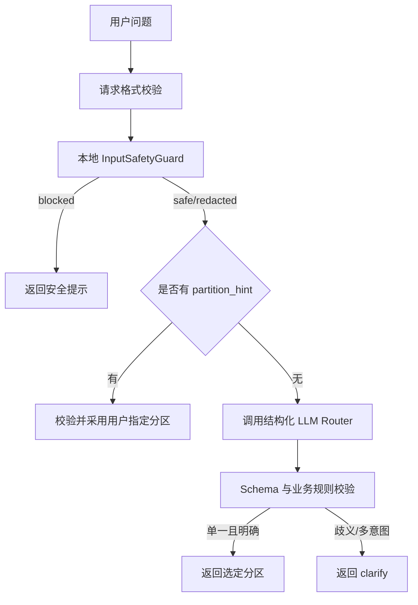
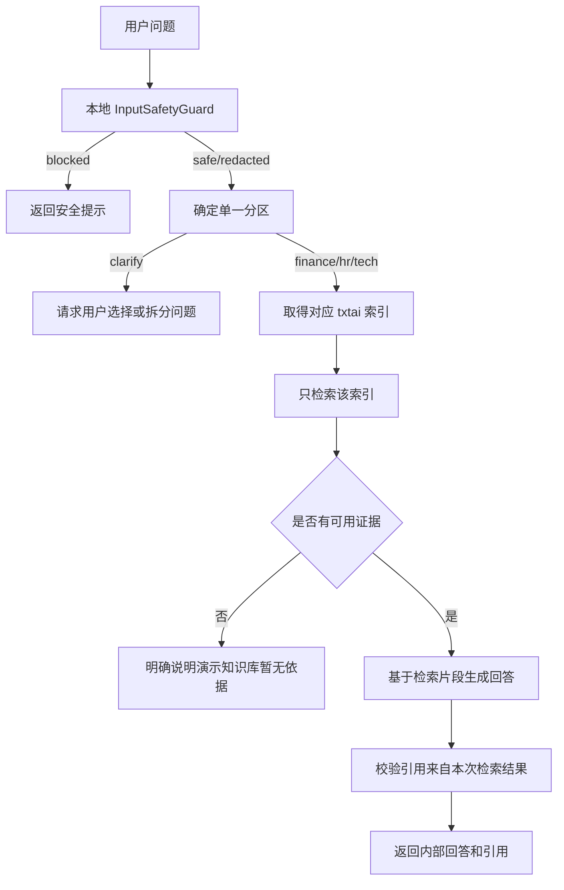

# 基于 txtai 的三分区路由知识库 MVP 实施规格

> 文档定位：第一轮可编码、可验证的实施规格。  
> 当前阶段：Round 1 / Partition Routing MVP。  
> 核心目标：验证三个独立 txtai 索引、输入安全预处理、稳定分区路由和单分区限定检索。  
> 技术基线：Python 3.11、FastAPI、txtai、Pydantic、pytest。  
> 文档版本：v1.1。  
> 更新时间：2026-09-01。

---

## 1. 本轮结论

第一轮只交付以下能力：

1. 建立 `finance`、`hr`、`tech` 三个独立 txtai 索引。
2. 为每个分区预置少量可重复构建的测试文档。
3. 在调用远程 LLM 前执行本地输入安全检查和必要脱敏。
4. 实现结构化分区路由，并提供 `/api/v1/route` 调试接口。
5. `/api/v1/chat` 支持显式 `partition_hint`。
6. 每次查询只允许访问一个最终选定的分区索引。
7. 建立 60 条路由测试集，输出准确率、分类报告和混淆矩阵。

本轮暂不实现：

- 登录、用户身份、角色和权限控制。
- 文档上传、审批和生产级入库流程。
- 文档版本替换和复杂索引事务。
- 联网搜索与外部资料回写。
- 多分区并行召回。
- GraphRAG、多 Agent 或自主工具调用。
- 正式敏感数据接入。
- OCR、Excel、PPTX 和图片解析。
- 独立 Reranker 和模型微调。

本轮只能使用虚构或脱敏的演示数据。禁止将真实工资、个人信息、密码、Token、内部 IP、客户数据或未公开经营数据放入测试索引。

---

## 2. 核心设计原则

### 2.1 路由和检索职责分离

LLM 只负责理解问题并输出候选业务分区，不得直接选择索引对象、执行检索或决定是否联网。

最终索引选择必须由确定性业务代码完成：

```text
RouteDecision
→ RoutingPolicy
→ Partition 枚举
→ IndexRegistry.get(partition)
```

### 2.2 用户显式选择优先

当 `/chat` 或 `/route` 请求包含合法 `partition_hint` 时：

- 直接使用该分区。
- 不调用 LLM 路由器。
- 仍需执行输入安全检查和请求校验。
- 响应中的 `decision_source` 必须为 `user_hint`。

优先级固定为：

```text
合法 partition_hint
> 已确认的路由结果
> LLM 路由结果
> clarify
```

第一轮不实现服务端对话记忆，因此“已确认的路由结果”只作为后续扩展点，不在本轮编码。

### 2.3 不使用 LLM 自报数值置信度

禁止要求 LLM 输出 `confidence: 0.83` 并用固定阈值决定是否检索。这个数字不是校准概率，会随模型、Prompt 和示例变化。

第一轮改为：

- LLM 输出分类、备选分区和是否存在歧义。
- 业务层只接受合法、单一且无歧义的分类。
- 歧义或多意图问题返回 `clarify`。
- 系统可靠性通过 60 条标注数据测量，而不是相信单次模型自评分。

### 2.4 原始问题不得无条件发送给远程 LLM

在调用 Router LLM 和 Answer LLM 前，必须先经过本地 `InputSafetyGuard`。

安全处理结果分为：

```text
safe       可以使用原问题
redacted   只能使用脱敏后的问题
blocked    不得发送到远程 LLM
```

若配置为本地 LLM，仍执行格式、长度和明显密钥检测，但可以由配置决定是否需要脱敏。

### 2.5 单分区限定检索

一次请求最终只能选定一个业务分区，并且只能调用对应索引一次。

```text
finance 问题 → 只调用 finance 索引
hr 问题      → 只调用 hr 索引
tech 问题    → 只调用 tech 索引
clarify      → 不调用任何索引
```

跨分区问题第一轮返回澄清建议，不执行多个索引检索。

---

## 3. 总体数据流

### 3.1 `/route` 数据流



### 3.2 `/chat` 数据流



---

## 4. 业务分区

### 4.1 `finance`

包含：

- 差旅和日常报销。
- 发票、付款、预算和成本。
- 资产与会计处理。
- 财务审批流程。

典型问题：

- 北京出差住宿最多报销多少？
- 采购发票需要哪些附件？
- 服务器采购费用如何入账？

### 4.2 `hr`

包含：

- 招聘、入职、转正和离职。
- 考勤、请假、调休和加班。
- 劳动合同、绩效、福利和培训。

典型问题：

- 试用期转正需要提交哪些材料？
- 年假如何计算？
- 周末加班如何申请调休？

### 4.3 `tech`

包含：

- 软件架构、API 和数据库。
- Docker、网络、部署和运维。
- 开发规范、测试规范和故障处理。
- RAG、模型和算法技术文档。

典型问题：

- Docker 服务出现 502 如何排查？
- 单点登录回调地址如何配置？
- 如何重新构建 txtai 索引？

### 4.4 `clarify`

`clarify` 是路由控制状态，不是知识分区。以下情况进入 `clarify`：

- 一个问题包含两个必须分别检索的独立意图。
- 问题缺少关键对象，无法判断分区。
- LLM 输出多个并列候选，不能确定唯一分区。
- LLM 输出不符合 Schema，且一次修复重试后仍失败。

示例：

```text
新员工如何申请 GitLab 权限并报销认证考试费用？
```

返回建议：

```text
该问题包含技术权限申请和财务报销两个事项，请选择分区或拆成两个问题。
```

---

## 5. 推荐项目结构

```text
project-root/
├── app/
│   ├── main.py
│   ├── api/
│   │   ├── route.py
│   │   ├── chat.py
│   │   └── health.py
│   ├── core/
│   │   ├── config.py
│   │   ├── errors.py
│   │   └── logging.py
│   ├── models/
│   │   ├── partition.py
│   │   ├── routing.py
│   │   ├── retrieval.py
│   │   └── chat.py
│   ├── services/
│   │   ├── input_safety.py
│   │   ├── router.py
│   │   ├── routing_policy.py
│   │   ├── index_registry.py
│   │   ├── retriever.py
│   │   └── answer_generator.py
│   └── prompts/
│       ├── route_system.txt
│       └── answer_system.txt
├── data/
│   ├── fixtures/
│   │   ├── finance.jsonl
│   │   ├── hr.jsonl
│   │   └── tech.jsonl
│   └── indexes/
│       ├── finance/
│       ├── hr/
│       └── tech/
├── evaluation/
│   ├── routing_cases.jsonl
│   └── reports/
├── scripts/
│   ├── seed_demo_indexes.py
│   └── evaluate_routing.py
├── tests/
│   ├── unit/
│   ├── integration/
│   └── e2e/
├── .env.example
├── pyproject.toml
├── README.md
└── SPEC.md
```

`data/indexes` 和评估报告默认不提交 Git；测试数据、脚本和不包含敏感内容的评估样本可以提交。

---

## 6. 配置

```dotenv
APP_NAME=txtai-partition-routing-mvp
APP_ENV=development
APP_HOST=127.0.0.1
APP_PORT=8000

DATA_ROOT=./data
INDEX_ROOT=./data/indexes
FIXTURE_ROOT=./data/fixtures

EMBEDDING_MODEL=Qwen/Qwen3-Embedding-0.6B
RETRIEVAL_TOP_K=5

LLM_PROVIDER=openai_compatible
LLM_BASE_URL=
LLM_API_KEY=
LLM_MODEL=
LLM_DATA_MODE=remote

MAX_QUESTION_LENGTH=2000
ROUTER_RETRY_COUNT=1
LOG_LEVEL=INFO
```

约束：

- `LLM_DATA_MODE` 只能是 `local` 或 `remote`。
- 密钥只能从环境变量读取。
- 不记录原始敏感问题、完整 Token 或脱敏前内容。
- 应用启动时检查三个索引目录是否存在并可加载。
- 测试环境必须允许替换为 Fake LLM，以验证发送给模型的实际内容。

---

## 7. 数据模型

### 7.1 分区与路由枚举

```python
from enum import StrEnum


class Partition(StrEnum):
    FINANCE = "finance"
    HR = "hr"
    TECH = "tech"


class RouteName(StrEnum):
    FINANCE = "finance"
    HR = "hr"
    TECH = "tech"
    CLARIFY = "clarify"


class DecisionSource(StrEnum):
    USER_HINT = "user_hint"
    LLM = "llm"
    SAFETY_FALLBACK = "safety_fallback"
```

### 7.2 输入安全结果

```python
class SafetyAction(StrEnum):
    SAFE = "safe"
    REDACTED = "redacted"
    BLOCKED = "blocked"


class SafetyDecision(BaseModel):
    action: SafetyAction
    safe_question: str | None
    detected_types: list[str]
    message: str | None = None
```

`detected_types` 只记录类型，例如 `token`、`private_ip`、`phone`，不得记录匹配到的原始值。

### 7.3 LLM 原始路由输出

```python
class LLMRouteOutput(BaseModel):
    route: RouteName
    alternative_route: Partition | None = None
    rewritten_query: str
    needs_clarification: bool
    reason_code: Literal[
        "finance_policy",
        "hr_policy",
        "technical_operation",
        "multi_intent",
        "missing_context",
        "ambiguous_domain",
    ]
```

禁止在该模型中增加数值 `confidence` 字段。

### 7.4 最终路由结果

```python
class RouteDecision(BaseModel):
    route: RouteName
    alternative_route: Partition | None = None
    rewritten_query: str
    needs_clarification: bool
    decision_source: DecisionSource
    safety_action: SafetyAction
    reason_code: str
```

### 7.5 检索结果

```python
class RetrievalHit(BaseModel):
    chunk_id: str
    document_id: str
    partition: Partition
    text: str
    score: float
    title: str
    section: str | None = None
```

### 7.6 API 请求与响应

```python
class RouteRequest(BaseModel):
    question: str
    partition_hint: Partition | None = None


class ChatRequest(BaseModel):
    question: str
    partition_hint: Partition | None = None


class Citation(BaseModel):
    chunk_id: str
    document_id: str
    title: str
    section: str | None = None


class ChatResponse(BaseModel):
    answer: str
    route: RouteName
    decision_source: DecisionSource
    answerable: bool
    citations: list[Citation]
    request_id: str
    warning: str | None = None
```

---

## 8. 输入安全预处理

### 8.1 执行位置

`InputSafetyGuard` 必须在所有 LLM Provider 调用之前执行。不得将安全检查仅放在联网搜索之前。

```python
safety = input_safety.inspect(request.question)

if safety.action == SafetyAction.BLOCKED:
    return build_safety_response(safety)

question_for_model = safety.safe_question
```

### 8.2 第一轮检测范围

使用本地确定性规则检测：

- 明显 API Key、Bearer Token、JWT 和私钥片段。
- 数据库连接串中的密码。
- IPv4 私网地址。
- 身份证号、手机号和邮箱。
- 超长问题、空问题和控制字符。
- 常见系统提示词窃取或覆盖指令，仅作为风险标签，不作为业务答案依据。

### 8.3 处理策略

| 类型 | remote 模式 | local 模式 |
| --- | --- | --- |
| 手机、邮箱、私网 IP | 使用占位符脱敏后继续 | 可配置为脱敏后继续 |
| Token、密码、私钥 | 阻止发送并提示用户删除敏感值 | 默认阻止 |
| 超长输入 | 拒绝并返回长度错误 | 拒绝并返回长度错误 |
| 普通业务问题 | 原样继续 | 原样继续 |

脱敏示例：

```text
原问题：10.10.11.21 上的财务服务 Docker 502 怎么处理？
安全问题：[PRIVATE_IP] 上的财务服务 Docker 502 怎么处理？
```

安全处理不得改变核心业务意图。如果脱敏后无法判断意图，返回 `blocked` 或要求用户提供 `partition_hint`，不能自行补全事实。

### 8.4 日志要求

允许记录：

- `request_id`。
- `safety_action`。
- `detected_types`。
- 输入长度。
- 是否使用远程模型。

禁止记录：

- 脱敏前问题。
- 被识别出的 Token、手机号、邮箱或 IP 原值。
- 完整 LLM 请求体。

---

## 9. 路由器设计

### 9.1 路由 Prompt

```text
你是企业知识库分区路由器，只负责选择知识分区，不回答问题。

可选结果：finance、hr、tech、clarify。

finance：报销、发票、预算、付款、成本、资产和会计处理。
hr：招聘、入职、合同、考勤、请假、绩效、薪酬、福利和培训。
tech：研发、API、数据库、部署、网络、运维、系统配置和故障处理。
clarify：问题包含多个独立意图，或缺少足够信息，无法选择唯一分区。

规则：
- 按用户最终想得到的答案分类，不按职业或单个名词分类。
- 一个明确问题只选择一个分区。
- 多个必须分别回答的事项选择 clarify。
- alternative_route 只在确实存在第二种合理解释时填写。
- rewritten_query 只能消除口语表达，不得增加事实。
- 不输出数值置信度。
- 只输出符合 JSON Schema 的 JSON。
```

### 9.2 路由参数

- `temperature=0`。
- 优先使用 Provider 原生结构化输出。
- JSON 或 Schema 校验失败最多修复重试一次。
- 第二次失败后返回 `clarify`，不得默认进入某一分区。
- Router 接收的只能是 `SafetyDecision.safe_question`。

### 9.3 确定性决策规则

```python
def decide_route(
    request: RouteRequest,
    safety: SafetyDecision,
    llm_output: LLMRouteOutput | None,
) -> RouteDecision:
    if request.partition_hint is not None:
        return from_user_hint(request.partition_hint, safety)

    if safety.action == SafetyAction.BLOCKED:
        return blocked_route(safety)

    if llm_output is None:
        return clarify_route("router_invalid_output", safety)

    if llm_output.needs_clarification:
        return clarify_route(llm_output.reason_code, safety)

    if llm_output.route == RouteName.CLARIFY:
        return clarify_route(llm_output.reason_code, safety)

    if llm_output.alternative_route is not None:
        return clarify_route("ambiguous_domain", safety)

    return accepted_llm_route(llm_output, safety)
```

这套规则没有运行时数值阈值。是否可以上线由离线评估结果决定。

### 9.4 后续校准扩展点

第一轮积累真实问题后，可以增加语义分类器或规则分类器，与 LLM 结果进行一致性校验：

```text
规则/语义分类与 LLM 一致 → 接受
两者不一致               → clarify 或人工选择
```

该扩展必须基于标注集验证，不能重新引入未经校准的 LLM 自报分数。

---

## 10. 三个独立 txtai 索引

### 10.1 目录

```text
data/indexes/finance/
data/indexes/hr/
data/indexes/tech/
```

### 10.2 Index Registry

```python
class IndexRegistry:
    def load_all(self) -> None: ...

    def get(self, partition: Partition) -> Embeddings: ...

    def upsert_fixture_rows(
        self,
        partition: Partition,
        rows: list[dict],
    ) -> None: ...

    def save(self, partition: Partition) -> None: ...

    def close_all(self) -> None: ...
```

要求：

- 三个分区创建三个不同的 `Embeddings` 实例。
- 三个实例使用相同 Embedding 模型和检索配置。
- `get()` 只接受 `Partition` 枚举，禁止接受任意路径字符串。
- 预置数据使用稳定 Chunk ID 和 `upsert()`。
- 重复执行 seed 脚本不能生成重复 Chunk。
- 本轮默认单进程、单 Worker。

### 10.3 数据格式

```json
{
  "id": "finance-travel:v1:0001",
  "text": "文档：演示差旅制度\n章节：住宿标准\n正文：一线城市住宿演示上限为每人每天 600 元。",
  "document_id": "finance-travel",
  "partition": "finance",
  "title": "演示差旅制度",
  "section": "住宿标准"
}
```

即使索引已经物理分开，也必须保留 `partition` 元数据。检索结果返回后必须执行业务校验：

```python
if any(hit.partition != requested_partition for hit in hits):
    raise PartitionIsolationError(requested_partition)
```

不得使用生产环境中可能被优化掉的裸 `assert`。

---

## 11. 预置测试文档

每个分区预置两份虚构文档，每份包含 3～5 个 Chunk。

### 11.1 Finance fixtures

```text
finance-travel：演示差旅制度
- 住宿演示标准
- 交通费用演示规则
- 报销附件清单

finance-invoice：演示发票处理规范
- 发票抬头
- 发票查验
- 退票处理
```

### 11.2 HR fixtures

```text
hr-probation：演示转正规范
- 申请时间
- 申请材料
- 审批步骤

hr-leave：演示请假制度
- 年假计算
- 事假申请
- 调休规则
```

### 11.3 Tech fixtures

```text
tech-deployment：演示部署手册
- Docker 启动
- Nginx 502 排查
- 健康检查

tech-sso：演示单点登录手册
- OAuth 回调配置
- Token 生命周期
- 常见登录错误
```

Fixture 要求：

- 内容必须明确标记为演示数据。
- 金额、日期、域名和账号必须是虚构值。
- 每个 Chunk 使用稳定 ID。
- 文档答案应足够明确，便于检索断言。
- 每个分区至少准备两个“相似但答案不同”的 Chunk，用于测试误召回。

---

## 12. API 设计

### 12.1 路由调试接口

```http
POST /api/v1/route
Content-Type: application/json
```

请求：

```json
{
  "question": "技术人员出差如何报销？",
  "partition_hint": null
}
```

响应：

```json
{
  "route": "finance",
  "alternative_route": null,
  "rewritten_query": "员工出差费用如何报销",
  "needs_clarification": false,
  "decision_source": "llm",
  "safety_action": "safe",
  "reason_code": "finance_policy"
}
```

接口不得返回：

- LLM 隐藏思考过程。
- 脱敏前后的敏感值对照。
- Prompt 全文。
- API Key 或 Provider 请求体。

### 12.2 单分区问答接口

```http
POST /api/v1/chat
Content-Type: application/json
```

请求：

```json
{
  "question": "住宿演示标准是多少？",
  "partition_hint": "finance"
}
```

响应：

```json
{
  "answer": "根据《演示差旅制度》，一线城市住宿演示上限为每人每天 600 元。",
  "route": "finance",
  "decision_source": "user_hint",
  "answerable": true,
  "citations": [
    {
      "chunk_id": "finance-travel:v1:0001",
      "document_id": "finance-travel",
      "title": "演示差旅制度",
      "section": "住宿标准"
    }
  ],
  "request_id": "req_example",
  "warning": null
}
```

`partition_hint` 非法时返回 `422 INVALID_PARTITION`，不能交给 LLM 猜测。

### 12.3 Clarify 响应

```json
{
  "answer": "该问题包含多个事项，请选择 finance、hr 或 tech，或者拆分后提问。",
  "route": "clarify",
  "decision_source": "llm",
  "answerable": false,
  "citations": [],
  "request_id": "req_example",
  "warning": "需要确认知识分区。"
}
```

`clarify` 响应不得调用任何 txtai 索引。

### 12.4 健康检查

```http
GET /api/v1/health
```

响应至少包含：

```json
{
  "status": "ok",
  "indexes": {
    "finance": "ready",
    "hr": "ready",
    "tech": "ready"
  },
  "router": "configured"
}
```

---

## 13. 单分区检索与回答

### 13.1 检索接口

```python
class Retriever:
    def search(
        self,
        partition: Partition,
        query: str,
        limit: int = 5,
    ) -> list[RetrievalHit]: ...
```

### 13.2 查询选择

第一轮优先使用原问题检索。`rewritten_query` 只在以下情况替代原问题：

- 原问题是明显口语化表达。
- 改写没有删除错误码、产品名、金额和专业术语。
- 改写来自合法 Router 输出。

服务应在日志中记录使用了 `original` 还是 `rewritten`，但不得记录敏感正文。

### 13.3 最小证据规则

本轮不实现独立 Evidence Gate，但必须满足以下最低要求：

- 没有命中结果时直接返回 `answerable=false`。
- Answer LLM 只能接收本次选定分区的 Top-K 片段。
- 回答必须输出引用 Chunk ID。
- 服务端验证引用全部来自本次命中。
- 引用为空或包含未知 ID 时，结果降级为不可回答。
- 不允许使用模型记忆补充演示制度、金额、日期或步骤。

### 13.4 核心编排

```python
async def answer_question(request: ChatRequest) -> ChatResponse:
    request_id = new_request_id()
    safety = input_safety.inspect(request.question)

    if safety.action == SafetyAction.BLOCKED:
        return build_safety_response(safety, request_id)

    route = await routing_service.route(
        safe_question=safety.safe_question,
        partition_hint=request.partition_hint,
        safety=safety,
    )

    if route.route == RouteName.CLARIFY:
        return build_clarify_response(route, request_id)

    partition = Partition(route.route.value)
    hits = retriever.search(
        partition=partition,
        query=select_retrieval_query(request.question, route, safety),
        limit=settings.retrieval_top_k,
    )

    validate_hits_belong_to_partition(hits, partition)

    if not hits:
        return build_no_evidence_response(route, request_id)

    answer = await answer_generator.generate(
        question=safety.safe_question,
        hits=hits,
    )

    return validate_and_build_internal_response(
        route=route,
        answer=answer,
        hits=hits,
        request_id=request_id,
    )
```

---

## 14. 60 条路由测试集

### 14.1 数据分布

`evaluation/routing_cases.jsonl` 固定为 60 条：

| 期望结果 | 数量 |
| --- | ---: |
| finance | 15 |
| hr | 15 |
| tech | 15 |
| clarify | 10 |
| 带上下文但仍可单独判断的边界问题 | 5 |
| 合计 | 60 |

最后 5 条仍必须标注为 `finance/hr/tech/clarify` 之一，单独增加 `case_type="boundary"`。

数据格式：

```json
{"id":"route-001","question":"差旅住宿费最多报多少？","expected_route":"finance","case_type":"direct"}
{"id":"route-016","question":"试用期转正需要哪些材料？","expected_route":"hr","case_type":"direct"}
{"id":"route-031","question":"Docker 容器启动后访问 502","expected_route":"tech","case_type":"direct"}
{"id":"route-046","question":"申请 GitLab 权限并报销培训费","expected_route":"clarify","case_type":"multi_intent"}
```

测试集必须覆盖：

- 不依赖明显关键词的问题。
- 带其他部门身份词但核心意图明确的问题。
- 中英文混合技术术语。
- 多意图和缺少对象的问题。
- 容易混淆的“财务系统技术故障”和“系统中的财务业务规则”。
- 同义表达、口语表达和简短追问式表达。

### 14.2 评估脚本输出

`scripts/evaluate_routing.py` 必须生成：

```text
evaluation/reports/routing-summary.json
evaluation/reports/confusion-matrix.csv
evaluation/reports/misclassified-cases.jsonl
```

控制台输出至少包含：

- 总体准确率。
- finance、hr、tech、clarify 的 precision、recall、F1。
- 4×4 混淆矩阵。
- 错分样本 ID、期望结果和实际结果。
- JSON/Schema 合法率。
- 平均路由耗时。

混淆矩阵格式：

```csv
expected/predicted,finance,hr,tech,clarify
finance,0,0,0,0
hr,0,0,0,0
tech,0,0,0,0
clarify,0,0,0,0
```

### 14.3 验收目标

- 总体准确率不低于 90%。
- finance、hr、tech 各自召回率不低于 85%。
- 明确单分区问题被错误送入另一业务分区的比例低于 5%。
- 结构化输出合法率达到 99%，测试环境目标为 100%。
- `partition_hint` 路由正确率为 100%。
- 多意图问题不得强制进入单一分区。

60 条数据只能用于第一轮基线评估，不足以证明生产准确率。修改 Prompt 或模型后必须重新执行全量评估，并保留报告。

---

## 15. 测试要求

### 15.1 输入安全测试

至少覆盖：

- 普通问题原样通过。
- 私网 IP 被替换为占位符。
- 手机和邮箱被脱敏。
- Token、JWT、数据库密码被阻止。
- 超长和空问题被拒绝。
- Fake Remote LLM 实际收到的内容不包含原始敏感值。
- 日志不包含脱敏前内容。

### 15.2 路由单元测试

至少覆盖：

- 合法结构化输出。
- 非法枚举。
- 缺失字段。
- 多余解释文本。
- 一次修复重试。
- 重试失败进入 `clarify`。
- `alternative_route` 非空进入 `clarify`。
- `partition_hint` 跳过 LLM 调用。

### 15.3 索引隔离测试

必须验证：

1. finance 请求只调用 finance 索引。
2. hr 请求只调用 hr 索引。
3. tech 请求只调用 tech 索引。
4. clarify 请求不调用索引。
5. 返回结果的 `partition` 与请求分区不一致时拒绝回答。
6. 重复运行 seed 脚本不会增加重复 Chunk。
7. 应用重启后可以重新加载三个索引。

建议为三个 Index 实例使用不同 Spy，断言未选中索引的调用次数为 0。

### 15.4 API 集成测试

覆盖：

- `/route` 正常路由。
- `/route` 使用 `partition_hint`。
- `/route` 返回 clarify。
- `/chat` 完成单分区检索并返回引用。
- `/chat` 无命中时明确返回无依据。
- 非法 `partition_hint` 返回 422。
- 输入安全阻断时没有发生 LLM 和索引调用。
- `/health` 返回三个索引状态。

---

## 16. 分阶段实施

### Phase 0：项目骨架

- [ ] 创建 FastAPI 项目。
- [ ] 配置 Pydantic Settings。
- [ ] 定义错误码、请求 ID 和结构化日志。
- [ ] 添加 `/health`。
- [ ] 锁定依赖版本。

交付：应用和测试框架可以启动。

### Phase 1：三个独立索引与演示数据

- [ ] 实现 `Partition` 枚举。
- [ ] 实现 `IndexRegistry`。
- [ ] 建立 finance/hr/tech 三个索引目录。
- [ ] 编写六份演示文档 fixture。
- [ ] 实现幂等 seed 脚本。
- [ ] 完成加载、持久化和隔离测试。

交付：三个索引可以独立查询演示数据。

### Phase 2：输入安全与路由

- [ ] 实现 `InputSafetyGuard`。
- [ ] 实现 LLM Provider 抽象和 Fake Provider。
- [ ] 定义无数值置信度的路由 Schema。
- [ ] 实现 Router 和 `RoutingPolicy`。
- [ ] 实现 `/api/v1/route`。
- [ ] 验证远程模型只收到安全处理后的问题。

交付：输入可以安全地路由到单一分区或 clarify。

### Phase 3：限定检索与 `/chat`

- [ ] 实现 `partition_hint`。
- [ ] 实现 Retriever。
- [ ] 强制单索引调用。
- [ ] 实现最小内部回答和引用校验。
- [ ] 实现 `/api/v1/chat`。
- [ ] 完成端到端测试。

交付：问题可以在唯一选定分区中检索并返回带引用回答。

### Phase 4：路由评估

- [ ] 建立 60 条路由测试集。
- [ ] 实现评估脚本。
- [ ] 输出分类报告和混淆矩阵。
- [ ] 分析错分样本。
- [ ] 调整 Prompt 或模型并重新评估。
- [ ] 在 README 中记录基线结果。

交付：路由质量可测量、可复现，而不是依赖主观 confidence。

---

## 17. 错误码

| 错误码 | HTTP | 说明 |
| --- | ---: | --- |
| `INVALID_PARTITION` | 422 | 非法 `partition_hint` |
| `INVALID_QUESTION` | 422 | 空问题、超长问题或格式错误 |
| `SENSITIVE_INPUT_BLOCKED` | 200 | 输入包含不应发送给模型的秘密值 |
| `ROUTER_INVALID_OUTPUT` | 200 | 路由修复失败，按 clarify 返回 |
| `ROUTE_CLARIFICATION_REQUIRED` | 200 | 需要用户选择或拆分问题 |
| `INDEX_NOT_READY` | 503 | 目标索引不可用 |
| `PARTITION_ISOLATION_VIOLATION` | 500 | 索引返回了其他分区结果 |
| `NO_INTERNAL_EVIDENCE` | 200 | 选定分区没有可用证据 |
| `LLM_TIMEOUT` | 504 | 模型调用超时 |

业务性结果使用 HTTP 200 时，响应体必须包含稳定的 `code` 字段，前端不能通过自然语言判断状态。

---

## 18. Definition of Done

以下条件全部满足，第一轮才算完成：

- [ ] finance、hr、tech 三个 txtai 索引物理独立。
- [ ] 六份虚构演示文档可以通过脚本幂等写入索引。
- [ ] 普通问题可以路由到合法单一分区。
- [ ] 多意图或歧义问题返回 clarify，且不调用索引。
- [ ] Router 不输出也不依赖数值 confidence。
- [ ] 远程 LLM 只能收到本地安全处理后的问题。
- [ ] Token、密码和私钥不会发送给远程 LLM。
- [ ] `/api/v1/route` 可以显示结构化路由结果。
- [ ] `/api/v1/chat` 支持 `partition_hint`，并且用户选择优先。
- [ ] 每次问答只查询一个索引。
- [ ] 返回的引用全部来自本次检索结果。
- [ ] 没有内部证据时明确说明暂无依据。
- [ ] 60 条路由数据可以一键评估。
- [ ] 生成准确率、分类报告、混淆矩阵和错分清单。
- [ ] 总体路由准确率达到本轮目标。
- [ ] 输入安全、路由、索引隔离和 API 集成测试通过。
- [ ] README 包含安装、配置、seed、启动、测试和评估命令。

---

## 19. 下一轮扩展顺序

完成第一轮并获得真实评估结果后，再按以下顺序扩展：

1. 登录与用户身份接入。
2. 分区级和文档级权限过滤。
3. 文档上传、解析、Chunking 和审核入库。
4. 版本替换、删除和索引恢复机制。
5. 独立 Evidence Gate 与阈值校准。
6. 多分区候选召回。
7. 受控联网搜索。
8. 外部资料待审核区。

权限接入前，不得将本 MVP 用于真实敏感企业知识。

---

## 20. 给编码 Agent 的首个任务

```text
请完整阅读项目中的 SPEC.md 和 AGENTS.md。本轮只完成 Phase 0 和 Phase 1：

1. 创建 FastAPI 项目骨架、配置和健康检查。
2. 实现 finance、hr、tech 分区枚举。
3. 实现三个独立 txtai Embeddings 实例的 IndexRegistry。
4. 创建六份虚构演示文档 fixture。
5. 实现可重复执行的 seed_demo_indexes.py。
6. 编写索引物理隔离、幂等写入、持久化和重启加载测试。

不要实现权限、联网、文档上传、复杂版本、多分区检索或前端。

开始编码前先说明：
- 当前目录结构；
- 准备新增或修改的文件；
- 实现步骤；
- txtai API 和持久化方式的验证计划。

完成后报告：
- 修改文件；
- 测试命令和真实结果；
- 三个索引的演示查询结果；
- 已知限制和下一阶段入口。
```
